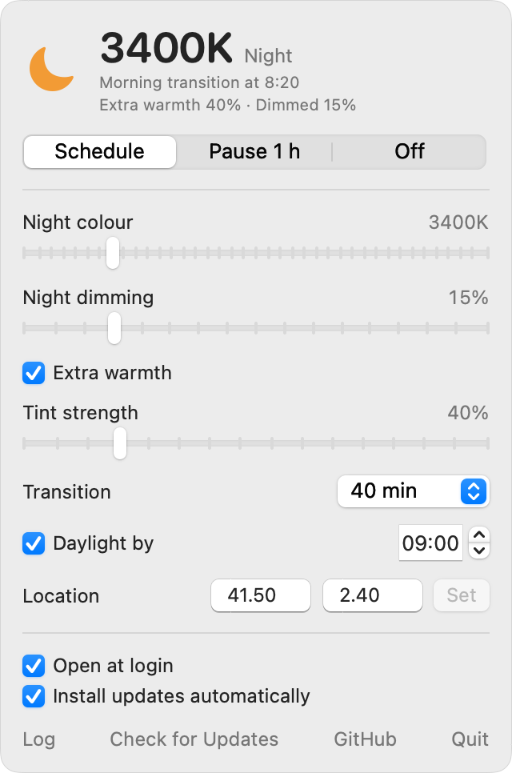

<div align="center">

<h1>MacDimScreen</h1>

<p><strong>A free, open-source f.lux alternative for Mac.</strong><br/>
Warms and dims your screen after sunset, including on M5 Macs, where f.lux no longer works.</p>

<a href="https://github.com/estevecastells/macdimscreen/releases/latest/download/MacDimScreen-macos-arm64.zip"></a>

<p>
<a href="https://github.com/estevecastells/macdimscreen/releases/latest"></a>

<a href="https://github.com/estevecastells/macdimscreen/actions/workflows/ci.yml"></a>
<a href="LICENSE"></a>
</p>

**Or install in one line** (no password, checksums verified):

</div>

```sh
curl -fsSL https://raw.githubusercontent.com/estevecastells/macdimscreen/main/scripts/get.sh | bash
```

<p align="center">
  <picture>
    <source media="(prefers-color-scheme: dark)" srcset="docs/images/panel-dark.png">
    
  </picture>
</p>

## Why not f.lux?

f.lux changes the screen colour through the display's gamma tables. On M5 Pro, M5 Max and MacBook Neo Macs running macOS 26, the display ignores those changes ([Apple bug FB22273730](https://developer.apple.com/forums/thread/819331)). f.lux keeps running, but your screen stays blue.

MacDimScreen gets the same result through parts of macOS that still work: Night Shift's colour engine, the Accessibility colour tint and a dimming overlay. It works on every Mac with Night Shift, not just the affected ones.

| | Night Shift | f.lux | MacDimScreen |
|---|---|---|---|
| Works on M5 Pro / Max (macOS 26) | ✅ | ❌ | ✅ |
| Warmer than 2700K | ❌ | ✅ | ✅ with Extra warmth |
| Open source | ❌ | ❌ | ✅ MIT |

## Features

- **Follows the sun.** Warms up gradually from sunset, and is back to normal colours by your wake time (or sunrise).
- **Switching from f.lux is painless.** On first run it imports your f.lux location, night colour and wake time.
- **Extra warmth** for an f.lux-style orange beyond Night Shift's limit.
- **Night dimming** for late nights, even below the lowest brightness.
- **Pause for an hour** or turn it off from the menu bar. Sliders preview live, even during the day.
- **Every app is tinted the same**, on built-in and external displays.
- **Updates itself.** New releases are checked, signature-verified and installed automatically (you can turn this off).
- **Leaves no trace.** Quitting or uninstalling restores your Night Shift and colour filter settings.

## Install

1. Run the one-line installer above, **or** download the app, move it to Applications, open it and click **Install Background Service**.
2. Quit f.lux (the installer does this for you).

The app isn't notarized yet. If you downloaded it in a browser, the first time you open it go to **System Settings → Privacy & Security** and click **Open Anyway**.

**Uninstall:** run `~/Library/Application\ Support/MacDimScreen/uninstall.sh` (add `--purge` to also delete settings), then delete the app.

## Command line

```sh
dimctl status                     # what the screen is doing now
dimctl plan                       # today's schedule, hour by hour
dimctl pause 30                   # back to normal for 30 minutes
dimctl off / dimctl auto          # turn off, or back on the schedule
dimctl set --night 3000 --tint 40 --dim 20 --wake 07:30
```

Settings live in `~/Library/Application Support/MacDimScreen/config.toml`, and the log in `~/Library/Logs/MacDimScreen/dimd.log`.

<details>
<summary><b>How it works</b></summary>

```
 menu bar app (Swift) ──JSON over Unix socket──▶ dimd (Rust, runs as you, launchd agent)
   └ dimming overlay                                ├─▶ Night Shift: colour temperature
 dimctl (CLI) ──────────────────────────────────────┘└─▶ Color Filters: extra warmth
```

Every 15 seconds `dimd` works out the sun's position for your location and where you are between day and night, then sets Night Shift to the matching colour temperature. Transitions are eased and interpolated in mireds (1e6 / K), so they look even, and Night Shift fades each small step itself. If something else changes Night Shift, the daemon sets it back on the next tick.

- **Colour temperature:** Night Shift (CoreBrightness), set to an exact kelvin value in manual mode. It works in the display pipeline, so every app is tinted evenly.
- **Extra warmth:** the Accessibility Color Tint filter, in amber. macOS won't set it below 25 %, so it switches on in one small step instead of fading in.
- **Dimming:** a click-through black overlay drawn by the menu bar app. Black at opacity *a* multiplies brightness by (1 − *a*), so it's exact in every app.

Custom ColorSync profiles were tried and rejected: apps that colour-manage themselves, such as Chrome and Electron apps, cancel or double the shift.

</details>

## Limitations

- Night Shift's own colour range ends at 2700K. Extra warmth goes beyond that.
- The dimming overlay needs the menu bar app running. The colour works without it.
- Night Shift and the colour filter are controlled through private macOS APIs, so a future macOS update could break them. Errors are shown in the panel and in `dimctl status`.

## Development

```sh
make ci         # fmt, clippy, Rust tests, Swift checks, shellcheck, app bundle
make install    # build and install the background service from source
make run-app    # build and open the menu bar app
```

The schedule logic (`crates/dim-core`) has no OS calls and is fully unit-tested. The daemon (`crates/dimd`) is tested against fakes of Night Shift and the colour filter. See [CONTRIBUTING.md](CONTRIBUTING.md).

## License

[MIT](LICENSE). Not affiliated with f.lux or Apple.
